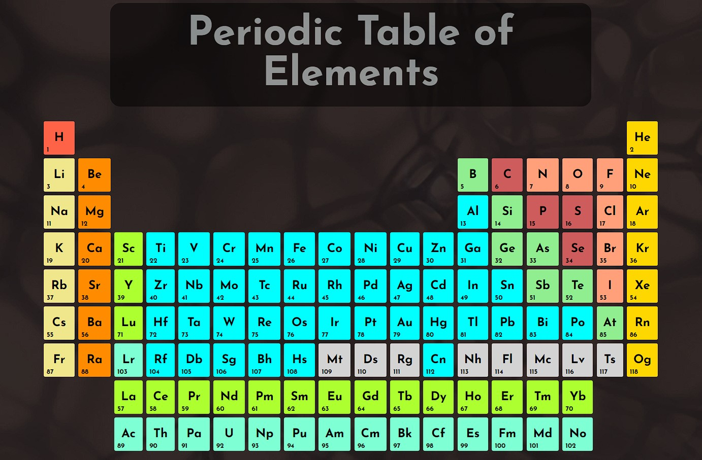

## In HTML and CSS

### Description

This was an ec project I can recall from Coding Dojo that has been on my mind since I finished. A simple and responsive web-page build of the periodic table to test my use of grid and styling. As simple as it may look, the table takes some interesting CSS knowledge to produce. You can find the latest version of the Periodic Table [here](https://rzralex.github.io/periodic_table/).

This is a Study of a periodic table developed by [Dudley Storey](https://codepen.io/dudleystorey/pen/rmWMXY) who I think provided the best model for what I was trying to learn and recreate. From this I gained a better understanding of controlling a large grid with less code and slightly more knowledge in pseudo-class usage. This is a good project for HTML and CSS experience but does take considerably more time than a regular project.

### Notes / References

* [Periodic Table](https://codepen.io/dudleystorey/pen/rmWMXY) by Dudley Storey
* General reference of the Periodic Table in [wikipedia](https://en.wikipedia.org/wiki/Periodic_table)
* Font used is [Josefin Sans](https://fonts.google.com/specimen/Josefin+Sans?query=josefin) by Santiago Orozco